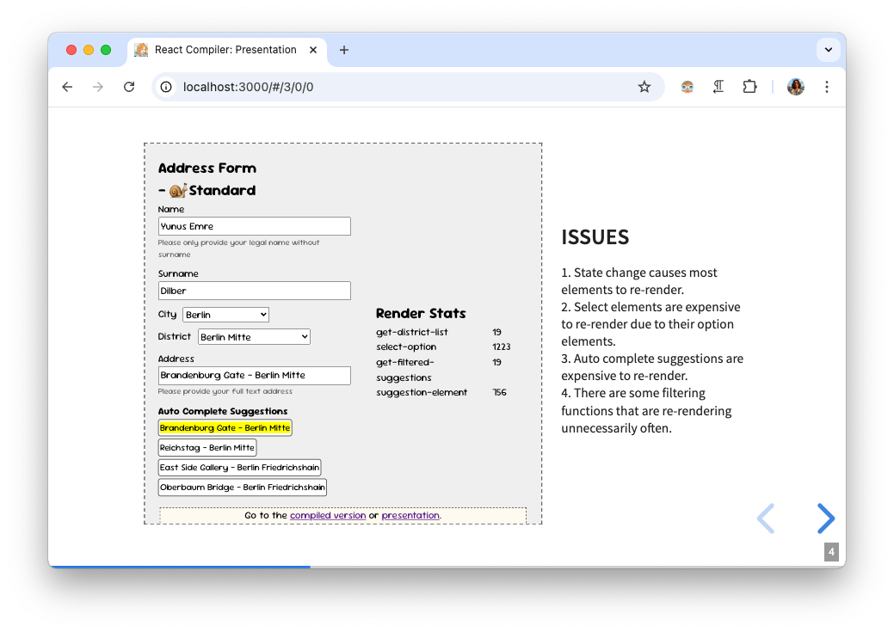

# React Compiler Presentation

Presentation URL: [https://yunusemredilber.github.io/react-compiler-presentation](https://yunusemredilber.github.io/react-compiler-presentation/#/)

The repo contains the presentation and demo apps for the React Compiler talk.



## Project Structure

The project is structured as follows:

### 1. Presentation

- `index.html` - The presentation content using [reveal.js](https://revealjs.com/).
- `public/*` - The images and styles for the presentation.

### 2. Demo Apps

- `src/*` - The shared source code for the demo apps.
- `non-compiled.html` - The non compiled React demo app.
- `webpack.config.ts` - The Webpack configuration for the compiled React demo app.
- `compiled.html` - The compiled React demo app.
- `non-react-compiler-webpack.config.ts` - The Webpack configuration for the compiled React demo app without the React compiler.

## Running the Presentation Locally

Install dependencies:
```bash
yarn install
```

Build demo apps in watch mode and serve the presentation:
```bash
yarn dev
```

Open the presentation in your browser: [http://localhost:3000](http://localhost:3000)

## Notes

- [This tool](https://www.accessify.com/tools-and-wizards/developer-tools/quick-escape/default.php) is used for escaping HTML content in the presentation.
